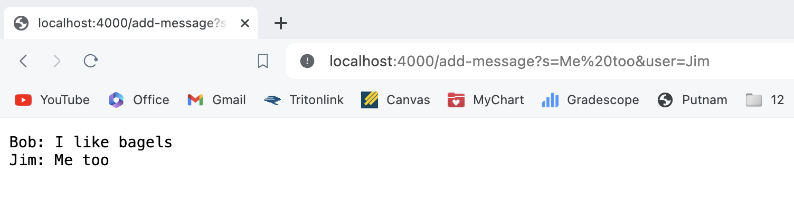

Lab Report 2 - Servers and SSH Keys (Week 3)
========
Ryan Zhang 

Part 1
--------
For this program, I used two files: `Server` and `chatServer`. The implementation of `Server` is the same as the one in the [wavelet example]((https://github.com/ucsd-cse15l-f23/wavelet)). Below is my implementation of `chatServer`:
```
import java.io.IOException;
import java.net.URI;

class Handler implements URLHandler {
    String output = "";
    public String handleRequest(URI url) {
        if (url.getPath().contains("/add")) {
            String[] parameters = url.getQuery().split("&");
            output+=String.format("%s: %s\n",parameters[1].substring(5),parameters[0].substring(2));
            return output;
        }
        return "404 Not Found!";
    }
}

public class chatServer {
    public static void main(String[] args) throws IOException{
        int port = Integer.parseInt(args[0]);
        Server.start(port, new Handler());
    }
}
```





