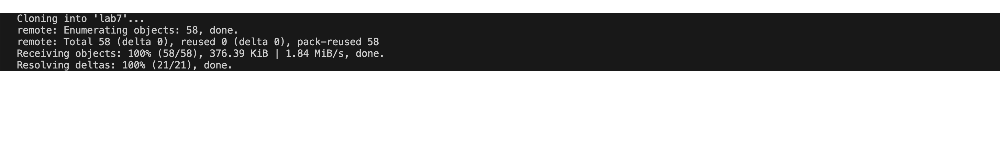

Lab Report 4 - Vim (Week 7)
========
Ryan Zhang   A17852116

Step 4: Logging in
--------
 
Keys Pressed: `s` `s` `h` `<space>` `r` `y` `z` `0` `0` `1` `@` `i` `e` `n` `g` `6` `.` `u` `c` `s` `d` `.` `e` `d` `u` `<enter>`  
I logged into ieng6 with the command ssh `ryz001@ieng6.ucsd.edu`. This process is pretty straightforward and I couldn't think of ways to lessen the number of keys pressed.

Step 5: Cloning Directory
--------

 
Keys Pressed: `g` `i` `t` `<space>` `c` `l` `o` `n` `e` `<space>` `<Command-C>` `<enter>`  
I cloned the repository with the command git clone 

Step 6: Running Test
--------
 
Keys Pressed: `c` `d` `<space>` `l` `a` `b` `7` `<enter>` `b` `a` `s` `h` `<space>` `t` `<tab>` `<enter>`  

Step 7: Editting File
--------
 

 

Keys Pressed: `v` `i` `m` `<space>` `L` `<tab>` `.` `j` `a` `v` `a` `<enter>` `<down>` `<down>` `<right>` `i` `<delete>` `2` `<esc>` `:` `w` `q `<enter>`  

Step 8: Editting File
--------
 
Keys Pressed: `<up>` `<up>` `<enter>`  

Step 9: Commiting and Pushing
--------
 
Keys Pressed: `g` `i` `t` `<space>` `a` `d` `d` `L` `<tab>` `.` `j` `a` `v` `a` `<enter>` `g` `i` `t` `<space>` `c` `o` `m` `m` `i` `t` `<space>` `-` `m` `<space` `u` `p` `d` `a` `t` `e` `<enter>` `g` `i` `t` `<space>` `p` `u` `s` `h` `<enter>`  

