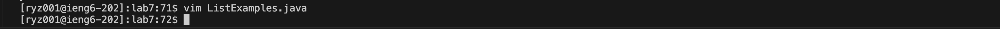

Lab Report 4 - Vim (Week 7)
========
Ryan Zhang   A17852116

Step 4: Logging in
--------
 
Keys Pressed: `s` `s` `h` `<space>` `r` `y` `z` `0` `0` `1` `@` `i` `e` `n` `g` `6` `.` `u` `c` `s` `d` `.` `e` `d` `u` `<enter>`  
I logged into ieng6 with the command ssh `ryz001@ieng6.ucsd.edu`. This process is pretty straightforward and I couldn't think of ways to lessen the number of keys pressed.

Step 5: Cloning Directory
--------

 
Keys Pressed: `g` `i` `t` `<space>` `c` `l` `o` `n` `e` `<space>` `<Command-V>` `<enter>`  
I cloned the repository with the command `git clone git@github.com:zre7926/lab7.git`. I copied the `SSH` URL from Github and pasted it into the command line, hence the <Command-V>.

Step 6: Running Tests
--------
 
Keys Pressed: `c` `d` `<space>` `l` `<tab>` `<enter>` `b` `a` `s` `h` `<space>` `t` `<tab>` `<enter>`  
I first changed directory into the `lab7` directory `cd lab7`. I used `<tab>` to autofill `lab7` from `l`. Then, I ran the command `bash test.sh` to run the tests. Again, I used `<tab>` to autofill `test.sh` from `t`.

Step 7: Editting File
--------
 

 

Keys Pressed: `v` `i` `m` `<space>` `L` `<tab>` `.` `j` `a` `v` `a` `<enter>` `<down>` `<down>` `<right>` `i` `<delete>` `2` `<esc>` `:` `w` `q `<enter>`  
I ran the command `vim ListExamples.java` to get into vim so I can edit the file `ListExamples.java` I autofilled `ListExamples` with `<tab>`. Then, I navigated the cursor with `<down>` and `<right>` keys to where the bug is. I went into insert mode with `i` and changed the `1` to `2` that caused the error. Finally, I saved and exitted vim with `:wq`.

Step 8: Running Tests Again
--------
 
Keys Pressed: `<up>` `<up>` `<enter>`  
I did two `<up>` commands because the `bash test.sh` command was two up in the bash history. I ran it again to run the tests again.

Step 9: Commiting and Pushing
--------
 
Keys Pressed: `g` `i` `t` `<space>` `a` `d` `d` `L` `<tab>` `.` `j` `a` `v` `a` `<enter>` `g` `i` `t` `<space>` `c` `o` `m` `m` `i` `t` `<space>` `-` `m` `<space` `u` `p` `d` `a` `t` `e` `<enter>` `g` `i` `t` `<space>` `p` `u` `s` `h` `<enter>`  
I added the editted file `ListExamples.java` to be committed with the command `git add ListExamples.java`. I autofilled `ListExamples` with `<tab>`. Then, I committed the changes with `git commit -m update`, which commits the changes with a commit message of "update". Finally, I pushed the changes with `git push`.
