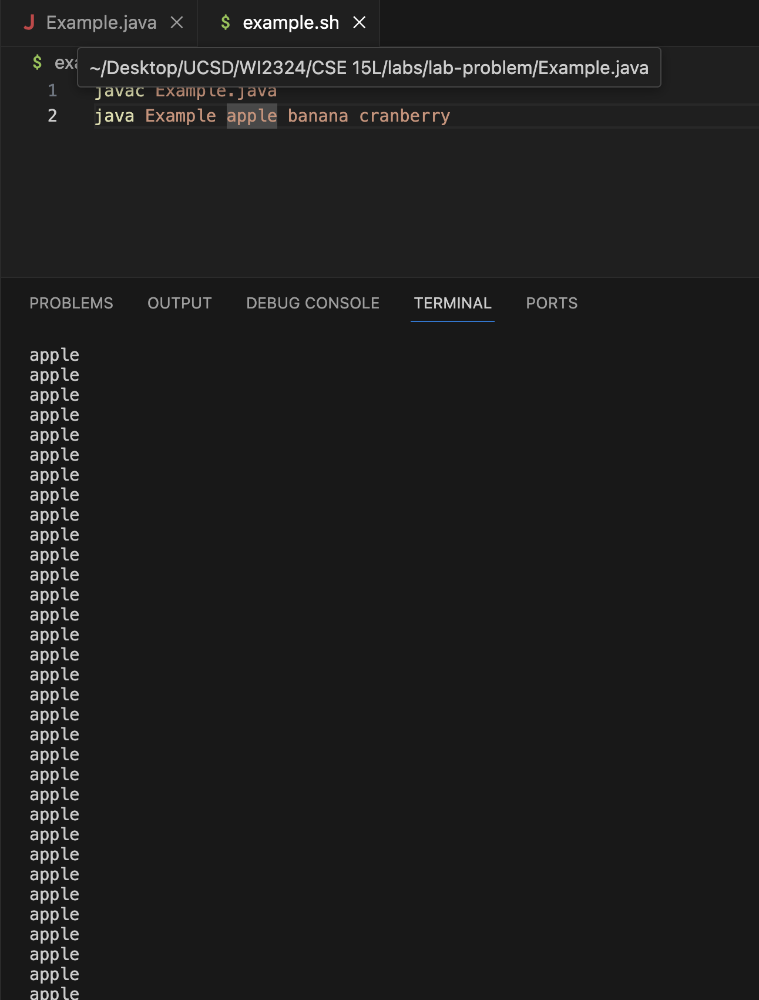

Lab Report 5 - Putting it All Together (Week 9)
========
Ryan Zhang <br> A17852116

Part 1 - Debugging Scenario
--------
**1. Original edstem post: <br> <br>**
*Bob Dylan (Student):<br>*
Hi! Please help me!!! <br> I ran my program Example.java with this bash script example.sh and it's BROKEN. It keeps printing "apple" on my terminal like so many times and it's not stopping! Help did I like break my computer or anger the Greek god of apples or something? I have to shut down my computer to stop it :(((. I think I did something wrong with my while loop and that's why this is happening but I don't knowwww. Please help me it is due in five minutes!

<br>

Here are my files:
```
/lab-problem/
|-  Example.java
|-  example.sh
```
Example.java:
```
1 public class Example {
2     public static void main(String[] args) {
3         int current = 0;
4         while(current < args.length) {
5             System.out.println(args[current]);
6         }
7     }
8 }
```
example.sh:
```
1 javac Example.java
2 java Example apple banana cranberry
```
What I did that made this happen is:
```
$ bash example.sh
```

**2. TA Response: <br> <br>**
*Timmy Jones (Teaching Assistant): <br>*
Hey Bob, What you are experiencing is an infinite loop. First, you can use `control` `C` to exit an infinite loop so you don't need to shut down your computer every time it happens. An infinite loop happens when you keep on satisfying the loop's condition infinitely, so what ever is inside executes over and over again. Check what your condition is for the while loop you have on line 4 of `Example.java`. Does the loop's content eventually cause the condition to be not satisfied so you can exit the loop? If not, what should you do so it does? <br> Good luck Bob!

**2. Student Response: <br> <br>**
*Bob Dylan (Student):<br>*
Wow! At first I was angry at you because you didn't show me what to do. But, after thinking about your advice for some time, I think I understand! Here's what I did to fix the bug: <br> 
Example.java
```
1 public class Example {
2     public static void main(String[] args) {
3         int current = 0;
4         while(current < args.length) {
5             System.out.println(args[current++]);
6         }
7     }
8 }
```
Now when I run it, it works!
```
$ bash example.sh
apple
banana
cranberry
```
My understanding is the following: The while loop's condition is `current < args.length`. In the loop I wasn't changing `current` so it would keep satisfying the condition. Now that I've changed the `current` in line 5 to `current++`, it works! This is because current++ changes current so it traverses the array properly and also would eventually not satisfy the condition so the loop is exited. I'm such a smart person wow. Thanks Timmy you are truly a superstar.  
<br><br>

Part 2 – Reflection
--------
I learned about so many cool things in lab during the second half of this quarter! I think the best are vim and debugger. Through vim, I am able to edit files from the terminal and with debugger I can track the files to find the errors in my code. They are both really useful tools for writing and editting code :)
